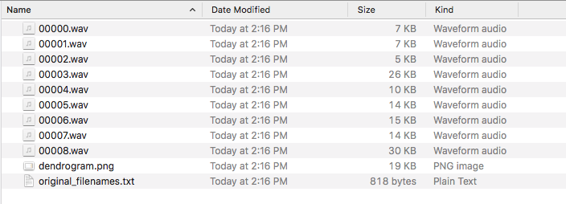

# WAV Clustering Workflow

This tool uses machine learning to organize a given collection of audio samples by acoustic similarity.

Presented as a workflow in `Python`, this project applies hierarchical clustering on 68 derived acoustic features for the purposes of grouping and ordering audio samples by similarity.  Then it uses the clustering to reorder the samples similarity and saves renamed copies of the `.wav` files to apply the new file organization. Finally, it saves a dendrogram for visualization of the clusters. 

The exploratory `R` code can be used to visualize a clustered feature heatmap and a UMAP dimensionality reduction.

The reliability of the algorithm was assessed on 71 Roland 909 drum machine samples from the free [BPB 909 Casette sample pack](https://bedroomproducersblog.com/2014/04/24/free-909-samples/). 
The algorithm perfectly separates 909 cymbals (hi-hats, ride cymbal, crash cymbal) from 909 membranophones ( kick drums, toms, snare drums) and further correctly separates and groups drums at a finer level ( e.g., all snare drums are grouped together).  Interesting groupings arise such as the 909 clap being grouped with crash and ride cymbals rather than the snare drum. 

Acoustic features are extracted from the first two non-overlapping 50 ms frames of the audio.  68 features per frame per sample are calculated using the pyAudioAnalysis library. Features include MFCCs, chroma, energy, spectral entropy, and more from `pyAudioAnalysis`.

To benchmark speed and scalability, hierarchical clustering was also run on 18 thousand drum machine samples (~5 Gb) from [kb6](https://samples.kb6.de/downloads.php), taking less than 1 hour on a 2019 MacBook Pro.  

Finally, the structure of the sorted output `.wav` files was designed to be compatible with the [TidalCycles pattern language for live-coding music](https://tidalcycles.org/Welcome).  
By reordering `.wav` files such that similar `.wav` files are next to one another, controlled variation can be achieved in TidalCycles by patterning the sample number.


## Requirements

* `Python 3`

#### Python modules:

* `pyAudioAnalysis`
* `pandas` 
* `scipy`
* `matplotlib`

#### optional R packages :

These R packages are for exploratory data visualization.  The 909 benchmark below uses them to plot the clustered feature heatmap and dimensionality reduction. (see script `visualize_clusters_and_umap.R`).  `R` and this script are not required to use this tool to cluster and organize audio samples.


* `data.table`
* `pheatmap`
* `ggplot2`
* `UMAP`


## 909 drum machine clustering benchmark results

This benchmark can be considered a positive control experiment.  

It was unclear whether hierarchical clustering could be used to reliably separate drum machine sounds, like bass drums, toms, hi-hats, snares, etc from one another.  This 909 benchmark experiment shows that the method is indeed reliable.

The **drum categories** (like "bd" for bass drum samples or "hh" for hi-hat samples) as dictated by the filename of the sample were used as "truth labels".  Because drum categories for were available for these samples (shown in the colored bar above the heatmap), it is possible to do a quick assessment to compare the drum categories to the clusters derived from purely acoustic properties.   Hierarchical clustering separates the drum categories surprisingly well.


The following UMAP projection reduces the dimensionality of the feature space from 136 (68 * 2 frames) to 2 dimensions. 

This UMAP plot is interesting but it is difficult to explain the groupings.  Perhaps it reflects similarities and differences in synthesis / sampling methods of the drums of the 909.  Clockwise from the left, we have membranophones, snares, and cymbals + clap.

NB:  The `R` script is required to generate plots like these.


## Performance benchmark:  18 thousand drum machine samples

 

45 thousand `.wav` files from several hundred unique drum machine models were first downloaded from [kb6](https://samples.kb6.de/downloads.php). 

18 thousand `.wav` files were long enough to extract features on two 50 ms frames.  Only these 18 thousand samples were hierarchically clustered; the others were excluded from the benchmark.

The total size of the input `.wav` files that were clustered was ~5 GB.
Feature extraction and hierarchical clustering completed in less than one hour on a 2019 MacBook Pro. 


## Usage

The easiest way to use this tool is as a `Python` module, via `import wav_clustering_workflow as wcw`

Additionally, the `glob` module (installed with Python) offers a convenient method for pattern matching.  `glob` supports Unix-style wildcards so it can be used to specify multiple `.wav` files with a single expression.

```python
# import this repository
import wav_clustering_workflow as wcw

# import glob; comes with Python
import glob


# set the parent directory for your samples.  this part of the path will not go into the name of the .wavs in the dendrogram visualization.
parent_dir = 'path/to/your/samples'


# make a list of absolute paths to all the .wav files you want to analyze. This is how the input is specified.
# use multiple subdirectories of the parent dir if you want! (shown with the first asterisk).  
# These subdirectories will be prepended to the name of the wav in the dendrogram.
wavs = glob.glob(parent_dir + 'sample_folder_*/*.wav')


# you can also add globbed lists together for more flexibility.
more_wavs = glob.glob(parent_dir + 'other_sample_folder_*/*.wav')
wavs = wavs + more_wavs


# Now we are ready to call the main function.
# Specify the number of frames to extract features from. Here we are using 2 frames.  2 seems to be sufficient for drum machine sample analyses. 
# You must also specify the name for the output directory.
# The output directory will include sorted copies of the input .wavs, the dendrogram visualization, and a text file showing the original paths of the .wavs

wcw.cluster_and_save_order(wavs, 2, parent_dir = parent_dir, outdir = 'your_output_directory')

```

More example functions can be found in the main code.  This last example takes all the samples from the Korg Minipops drum machine and saves them in a new directory called 'minipops_2frames'.

```python

parent_dir = '/Users/mclaurt/Music/dahnloads/kb6_drum_samples/ALL_EXTRACTED/'
# fix the '[' symbols in the directory by replacing '[' with '[[]'.
minipops_wavs = glob.glob(parent_dir + '[[]KB6[]]_Korg_Minipops/*.wav')
wcw.cluster_and_save_order(minipops_wavs, 2, parent_dir = parent_dir, outdir = 'minipops_2frames')
```
This output directory contains the following generated outputs including copied, renamed, and sorted `.wav` files:



## Features not yet implemented

* Command-line interface
* Test performance on longer samples, using either different window sizes or the different `pyAudioAnalysis` feature extraction functions for longer timescales.
* Interactive UMAP audio plot, like [this](https://petergill.shinyapps.io/shinyplay/) 
