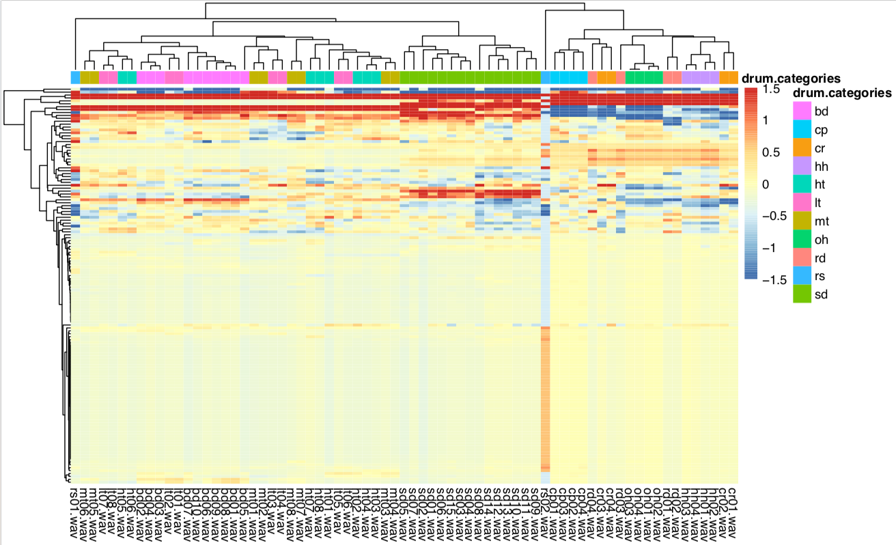
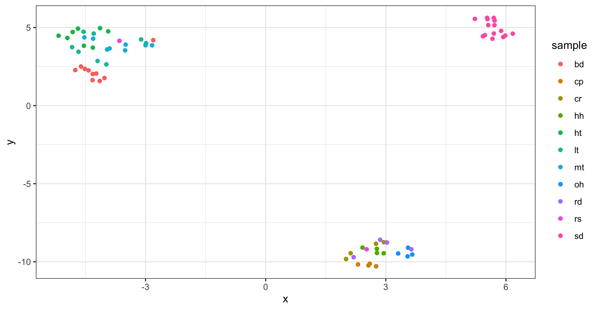
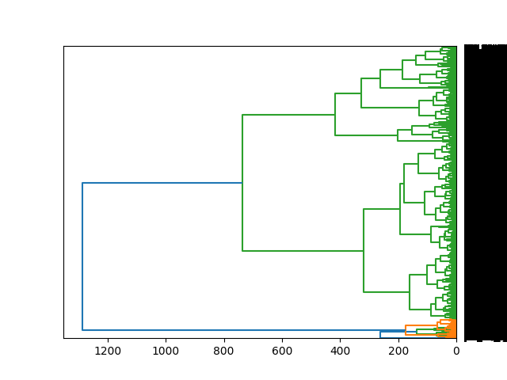

# WAV Clustering Workflow

This project uses machine learning to organize a given collection of audio samples by acoustic similarity.

Presented as a workflow in Python, this project uses hierarchical clustering of 68 derived acoustic features to group and order the samples by similarity.  Then it saves renamed copies of the wav files that are ordered by similarity. Finally, it saves a dendrogram for visualization. 

The exploratory R code can be used to visualize a clustered feature heatmap and a UMAP dimensionality reduction.

The reliability of the algorithm was assessed on 71 free Roland 909 drum machine samples from [BPB 909 Casette](https://bedroomproducersblog.com/2014/04/24/free-909-samples/). 
The algorithm successfully groups kick drums, toms, snare drums, and cymbals together.  Acoustic features are extracted from the first two non-overlapping 50 ms frames of the audio.  68 features per frame per sample are calculated using the pyAudioAnalysis library. Features include MFCCs, chroma, energy, spectral entropy, and more from pyAudioAnalysis.

For a performance benchmark, hierarchical clustering was also run on 18 thousand drum samples (~5 Gb) from [kb6](https://samples.kb6.de/downloads.php), taking about 1 hour on a 2019 MacBook Pro.  

Finally, the structure of the sorted output .wav files was designed to be compatible with the TidalCycles pattern language for live-coding music.  
By reordering .wav files such that similar .wavs are next to one another, subtle variation can be achieved in TidalCycles by patterning the sample number.


## Requirements

* Python 3

#### Python modules:

* pyAudioAnalysis
* pandas 
* scipy 
* matplotlib 

#### optional R packages :

These R packages are for exploratory data visualization.  The 909 benchmark below uses them to plot the clustered feature heatmap and dimensionality reduction. (in script 'visualize_clusters_and_umap.R').  You do not need them to cluster and organize your audio samples.


* data.table
* UMAP


## 909 drum machine clustering benchmark results

This benchmark can be considered a 'sanity check' or positive control experiment.  

I wanted to make sure hierarchical clustering could be used to reliably separate bass drums, toms, hi-hats, snares, etc from one another.  Since I had the drum categories (like "bd" for bass drum samples or "hh" for hi-hat samples) for these drum sounds, (shown in the colored bar above the heatmap), I could do a quick check to make sure the clusters derived from the acoustic properties align with the drum categories.  You can think of these drum categories as "truth labels".   You can see the algorithm does a pretty decent job.


I also made a UMAP projection to reduce the dimensionality of the feature space from 136 (68 * 2 frames) to 2 dimensions. 

This UMAP plot is interesting but it is difficult to explain the groupings.  I wonder if it reflects similarities in synthesis / sampling methods of the drums of the 909.

NB:  You will need to use the R script to generate plots like these.


## Performance benchmark:  18 thousand drum machine samples

 

I took 18 thousand .wav files from several hundred distinct drum machines from [kb6](https://samples.kb6.de/downloads.php). 

Feature extraction and hierarchical clustering took less than one hour on my 2019 MacBook Pro. 

This is fairly impressive considering the input .wav data is ~5 GB.  


## Usage

The easiest way to use this tool is as a python library with the glob module for pattern matching (glob comes with Python).  
glob supports Unix-style wildcards so you can use it to specify multiple .wav files with a single expression.

```python
# import this repo 
import wav_clustering_workflow as wcw

# import glob; comes with Python
import glob


# set the parent directory for your samples.  this part of the path will not go into the name of the .wavs in the dendrogram visualization.
parent_dir = 'path/to/your/samples'


# make a list of absolute paths to all the .wav files you want to analyze. This is how the input is specified.
# use multiple subdirectories of the parent dir if you want! (shown with the first asterisk).  
# These subdirectories will be prepended to the name of the wav in the dendrogram.
wavs = glob.glob(parent_dir + 'sample_folder_*/*.wav')


# you can also add globbed lists together for more flexibility.
more_wavs = glob.glob(parent_dir + 'other_sample_folder_*/*.wav')
wavs = wavs + more_wavs


# Now we are ready to call the main function.
# Specify the number of frames to extract features from. Here we are using 2 frames.  2 seems to be sufficient for drum machine sample analyses. 
# You must also specify the name for the output directory.
# The output directory will include sorted copies of the input .wavs, the dendrogram visualization, and a text file showing the original paths of the .wavs

wcw.cluster_and_save_order(wavs, 2, parent_dir = parent_dir, outdir = 'your_output_directory')
```


## Future directions 

* Commandline interface
* Test on longer samples, using different window sizes or the different pyAudioAnalysis feature extraction functions for longer timescales.
* Interactive UMAP audio plot, like [this](https://petergill.shinyapps.io/shinyplay/) 
